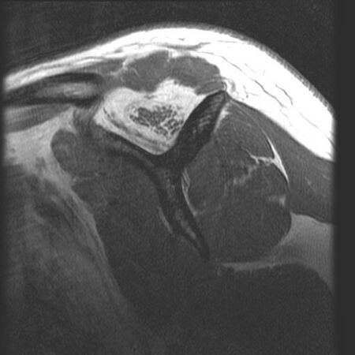

ShoulderAI_tangent is a Deep Learning project for lesion prediction on shoulder MRIs. The aim is to automatically segment tangent sign. 

> Keywords: Deep Learning, Segmentation, Rotator Cuff Tear
---

- [1. Description](#1-description)
- [2. Data organization](#2-data-organization)
- [3. Repo organization](#3-repo-organization)
- [4. Usage](#4-usage)

## 1. Description

The tangent sign is a valuable method for assessing fatty atrophy of the supraspinatus muscle belly, with a positive sign correlating to poorer outcomes after supraspinatus tendon repair. This sign is identified by drawing a tangent line from the upper edge of the scapular spine to the superior margin of the coracoid process, forming a structure resembling the letter "Y." To evaluate this, the most lateral T1-weighted (or possibly T2-weighted) MRI scans of the sagittal plane are used. When atrophy occurs, the supraspinatus muscle drops below the tangent line, indicating a positive tangent sign.

## 2. Data organization
The dataset consists of DICOM images from 96 patients, along with corresponding annotations. 

- A local `data` folder is automatically created when the segmentation script is run. This folder contains:
    - JPG images extracted from DICOMs
    - Masks for segmentation
    - CSV annotations


### Visual Example

Below are example visualizations for an MRI scan, its annotation, and the corresponding muscle mask:



    

## 3. Repo organization

The project repository is organized as follows:

```
shoulderai_tangent
    ├── segmentation      # Source code for the segmentation approach
        ├── ...
    ├── keypoint          # Source code for the keypoint-based approach
        ├── ...
    ├── assets            # Illustrative images
        ├── ... 
    README.md             # Project documentation
    .gitignore            # Git ignored files
```
## 4. Usage
You can clone the repository using:

```bash
git clone https://github.com/JulesGoninRIO/shoulderai_tangent  
```
### Running the Approaches
For detailed instructions on using the segmentation and keypoint-based methods, please refer to the README.md files within the respective folders (segmentation/ and keypoint/).


## 5. Contributors

This project was developed by [Mariia Vidmuk](https://git.dcc.sib.swiss/430278729552), [Khalil Achache](https://git.dcc.sib.swiss/khalilachache), [Lorena Egger](https://git.dcc.sib.swiss/lorena.egger) and [Alexandre Missenard](https://git.dcc.sib.swiss/alexandre.missenard)
