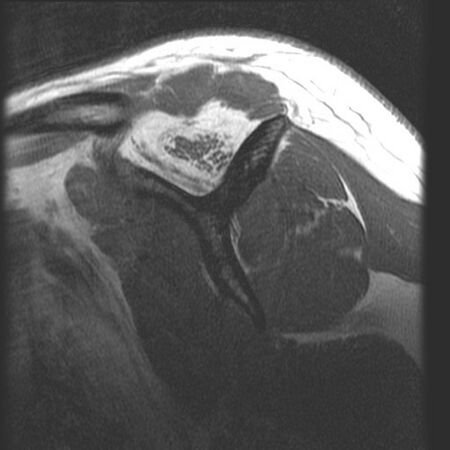
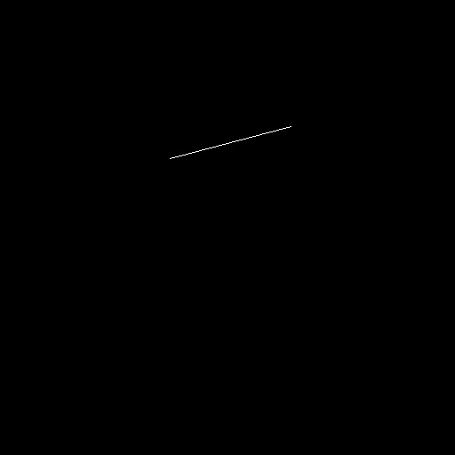
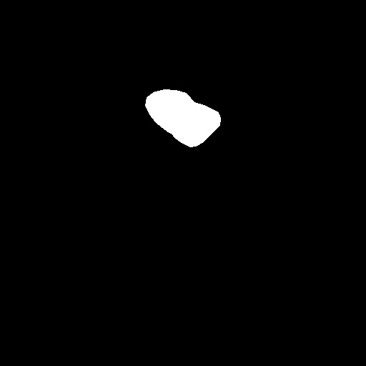

# ShoulderAI Tangent

ShoulderAI_tangent is a deep-learning project for automatic tangent-line localization and tangent-sign assessment on shoulder MRI. The repository compares a U-Net segmentation approach with a YOLO keypoint-detection approach.

> Keywords: Deep Learning, Segmentation, Keypoint Detection, Rotator Cuff Tear

---

- [1. Description](#1-description)
- [2. Dataset and required inputs](#2-dataset-and-required-inputs)
- [3. Repository organization](#3-repository-organization)
- [4. Reproduction instructions](#4-reproduction-instructions)
- [5. Contributors](#5-contributors)

## 1. Description

The tangent sign is used to assess atrophy of the supraspinatus muscle. It is evaluated by drawing a line from the upper edge of the scapular spine to the superior margin of the coracoid process on the most lateral sagittal MRI image showing the scapular “Y.” When the supraspinatus muscle lies below this line, the tangent sign is considered positive.

This repository evaluates two approaches:

- a U-Net model that predicts the tangent line as a segmentation mask
- a YOLO pose model that predicts the keypoints defining the tangent line

The predicted line is combined with the supraspinatus mask to calculate the percentage of muscle above the line and classify the tangent sign.

The final dataset contains **83 MRI examinations from 81 patients**, including bilateral examinations in two patients. One preselected sagittal MRI image is used for each examination.

### Visual examples

MRI image:



Expert tangent-line annotation:



Supraspinatus muscle mask:



## 2. Dataset and required inputs

The study images and annotations are not distributed with this repository. Prepared data must be placed under `data/`.

### 2.1 Required cohort CSV files

Before creating the folds, provide the following two files.

#### `data/tangent_sign_expert_annotation.csv`

This file defines the available cases and their expert tangent-sign classifications.

It may contain additional columns, but these columns are required:

| Column | Required content |
|---|---|
| `image_file` | Image filename or case identifier. The filename stem must match the corresponding images, masks, and annotations. |
| `tangent_sign_numeric` | Binary expert classification. Use `0` for a negative tangent sign and `1` for a positive tangent sign. |

Example:

```csv
image_file,tangent_sign_numeric
A0001.jpg,0
A0002.jpg,1
F0051-2.jpg,1
```

Important naming rules:

- The extension in `image_file` is allowed because the code uses the filename stem.
- One row per MRI examination is expected.
- Rows with a missing `image_file` or `tangent_sign_numeric` are discarded.
- Repeated examinations ending in `-2`, `-3`, and so on are grouped under the same base patient during fold creation. For example, `F0051`, `F0051-2`, and `F0051-3` are always assigned to the same held-out fold.

#### `data/cohort_exclusions.csv`

This file defines cases that must be removed before the study folds are created.

Required columns:

| Column | Required content |
|---|---|
| `case_id` | Case identifier. A file extension is not required. |
| `scope` | Either `exact` or `base`. |
| `reason` | Optional but recommended description of the exclusion reason. |

The two scopes have different meanings:

- `exact` excludes only the listed examination.
- `base` excludes the listed base patient and all repeated examinations belonging to that patient.

Example:

```csv
case_id,scope,reason
A0191,exact,Missing required annotation
F0051,base,Patient-level exclusion
```

When there are no exclusions, the file must still exist with its header:

```csv
case_id,scope,reason
```

Exclusions are applied only by `create_splits.py`. All downstream scripts use the generated split CSVs as the single source of truth for cohort membership.

### 2.2 U-Net segmentation inputs

```text
data/
└── sagittal/
    ├── images/
    │   └── T1_sag/
    │       ├── A0001.jpg
    │       └── ...
    └── masks/
        └── T1_sag/
            ├── tangent_sign/
            │   ├── A0001.jpg
            │   └── ...
            └── supraspinatus/
                ├── A0001.jpg
                └── ...
```

For each case, the MRI, tangent-line mask, and supraspinatus mask must have the same filename.

Pre-generated files ending in `_aug.jpg` may be present. They are used only for training and are excluded from validation and testing.

When these JPG images and masks have not yet been generated from the original DICOM images and annotations, follow the preparation instructions in [`segmentation/README.md`](segmentation/README.md).

### 2.3 YOLO keypoint inputs

```text
data/
└── keypoints/
    └── original/
        ├── images/
        │   ├── A0001.jpg
        │   └── ...
        ├── annotations/
        │   ├── mask/
        │   │   ├── A0001.jpg
        │   │   └── ...
        │   ├── txt/
        │   │   ├── A0001.txt
        │   │   └── ...
        │   └── yolo/
        │       ├── A0001.txt
        │       └── ...
        └── muscle_segmentation/
            ├── A0001.jpg
            └── ...
```

The folders contain:

| Folder | Purpose |
|---|---|
| `images/` | MRI JPG images used by the keypoint model. |
| `annotations/mask/` | Expert tangent-line masks used to generate endpoint annotations when needed. |
| `annotations/txt/` | Expert tangent-line endpoint coordinates used during evaluation. |
| `annotations/yolo/` | YOLO pose labels containing the bounding box and three keypoints used for training. |
| `muscle_segmentation/` | Supraspinatus masks used to calculate localization metrics. |

The image and annotation filenames must use the same case identifier.

When the endpoint or YOLO labels have not yet been generated, follow the annotation instructions in [`keypoints/README.md`](keypoints/README.md).

## 3. Repository organization

```text
shoulderai_tangent/
├── create_splits.py              # Creates the shared five-fold cohort splits
├── second_level_analysis.py      # Final tangent-sign classification analysis
├── segmentation/                 # U-Net segmentation approach
├── keypoints/                    # YOLO keypoint approach
├── analysis/                     # Additional summaries, figures, and paper analyses
├── data/                         # Local study data and generated split files
├── assets/                       # Illustrative images
├── README.md                     # General overview and reproduction instructions
└── .gitignore                    # Git ignored files
```

The main pipeline is:

```text
expert classifications and cohort exclusions
                    ↓
             create_splits.py
                    ↓
        shared five-fold split CSVs
          ┌─────────┴─────────┐
          ↓                   ↓
     U-Net pipeline      YOLO pipeline
          └─────────┬─────────┘
                    ↓
       second_level_analysis.py
                    ↓
      tangent-sign classification
```

## 4. Reproduction instructions

Run the commands below from the repository root unless stated otherwise.

### 4.1 Clone the repository

```bash
git clone https://github.com/JulesGoninRIO/shoulderai_tangent
cd shoulderai_tangent
```

The U-Net and YOLO pipelines have separate dependency files:

```text
segmentation/requirements.txt
keypoints/requirements.txt
```

Using separate environments for the two pipelines is recommended. Detailed environment instructions are provided in:

- [`segmentation/README.md`](segmentation/README.md)
- [`keypoints/README.md`](keypoints/README.md)

### 4.2 Create the shared five-fold splits

After placing the two required CSV files in `data/`, run:

```bash
python create_splits.py
```

The script reads:

```text
data/tangent_sign_expert_annotation.csv
data/cohort_exclusions.csv
```

and writes:

```text
data/split_labels_fold_0.csv
data/split_labels_fold_1.csv
data/split_labels_fold_2.csv
data/split_labels_fold_3.csv
data/split_labels_fold_4.csv
```

Each generated split file contains:

| Column | Meaning |
|---|---|
| `patient` | Case identifier derived from `image_file`. |
| `phase` | `test` for cases assigned to that fold and `train` for all other cases. |

For model fold `i`:

- fold `i` is the test set
- fold `(i + 1) mod 5` is the validation set
- the remaining three folds are the training set

Repeated examinations from the same base patient are kept together. The split-generation seed is fixed, so rerunning the script with the same input CSVs produces the same folds.

### 4.3 Run the U-Net segmentation pipeline

If the segmentation JPG images and masks still need to be prepared:

```bash
python segmentation/rebuild_seg_data.py
```

Train the five U-Net models:

```bash
python segmentation/segmentation_model.py --mode train
```

The fold checkpoints are saved under:

```text
segmentation/check/
```

Evaluate the five held-out test folds:

```bash
python segmentation/segmentation_model.py --mode test
```

Testing calibrates the pixel-probability threshold on the validation fold and then evaluates the corresponding held-out test fold.

Detailed configuration and output information are provided in [`segmentation/README.md`](segmentation/README.md).

### 4.4 Run the YOLO keypoint pipeline

Create the fold-specific YOLO train, validation, and test datasets:

```bash
python keypoints/data_scripts/create_dataset.py
```

This writes:

```text
data/keypoints/yolo_dataset_5fold/
keypoints/yamls_5fold/
```

Place the pretrained starting checkpoint expected by the training script at:

```text
keypoints/model_yolo11l-pose.pt
```

Train the five YOLO models:

```bash
python keypoints/train.py
```

The best checkpoints are saved under:

```text
keypoints/models_5fold/fold_0/weights/best.pt
...
keypoints/models_5fold/fold_4/weights/best.pt
```

Evaluate the held-out test folds:

```bash
python keypoints/evaluate.py
```

The combined localization results are saved to:

```text
keypoints/evaluation/results.csv
```

Detailed annotation, training, and evaluation instructions are provided in [`keypoints/README.md`](keypoints/README.md).

### 4.5 Run the final tangent-sign classification analysis

The final analysis requires the five trained U-Net checkpoints and five trained YOLO checkpoints:

```text
segmentation/check/*fold_*.ckpt
keypoints/models_5fold/fold_*/weights/best.pt
```

Run:

```bash
python second_level_analysis.py
```

The script:

- generates the continuous percentage of supraspinatus muscle above each predicted line
- calibrates thresholds using the combined training and validation data
- evaluates each held-out test fold
- reports the maximum-F1, false-positive-rate, and no-false-negative threshold strategies
- saves predictions, thresholds, metrics, ROC results, and confusion matrices

Outputs are written to:

```text
second_level_results/
```

The continuous model scores are cached in:

```text
second_level_results/continuous_scores.csv
```

Delete this cache before rerunning inference after changing:

- the cohort or split files
- a checkpoint
- model code
- preprocessing
- postprocessing

### 4.6 Optional analyses

The scripts under `analysis/` produce additional paper and quality-control outputs. They are not required to train the models or run the final classification analysis.

Examples include:

```bash
python analysis/summarize_segmentation_metrics.py
python analysis/compare_models.py
python analysis/extract_unet_training_history.py
python analysis/plot_unet_validation_losses.py
python analysis/plot_yolo_training_losses.py
python analysis/scanner_distribution.py
```

## 5. Contributors

This project was developed by [Mariia Vidmuk](https://git.dcc.sib.swiss/430278729552), [Khalil Achache](https://git.dcc.sib.swiss/khalilachache), [Lorena Egger](https://git.dcc.sib.swiss/lorena.egger), [Alexandre Missenard](https://git.dcc.sib.swiss/alexandre.missenard) and [Adrian Bohnenblust](https://github.com/AdrianBoh).
